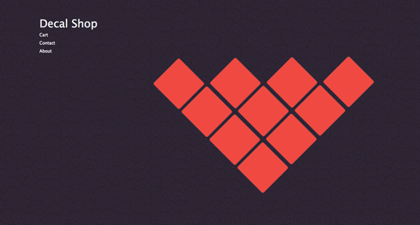

##Lil' Shop o' Decals

[Trello](https://trello.com/b/TeRmcDrT/my-shop-o-decals)

###My Approach

I already have an online decal shop made with Shopify's template tools. Now that I have my own web programming skillz I wanted to make a new decal shop from scratch. It doesn't have every feature that my Shopify store has but I'll get there with time and practice. I didn't want to spend a lot of time implementing Oauth so I decided to integrate PayPal's API to take care of all the transactions. That way there's no login but as long as the customer has a PayPal account they can securely purchase decals through my site.

###Technologies

- HTML
- CSS
- Bootstrap
- jQuery
- PayPal Oauth 
- Express
- Node
- Passport

###Major Problems
- Getting that nifty mouseover trick to happen over the decals took a long time to get right because I wrote the `<tr>` and `<td>` tags backwards and the table wouldn't show up in the DOM. Weird!